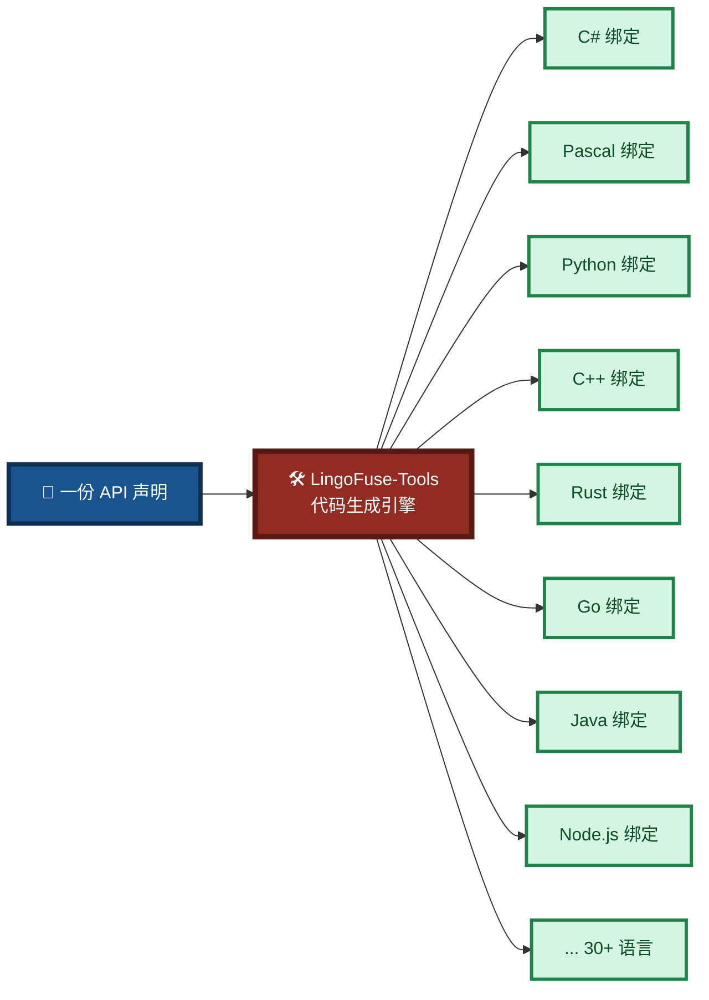
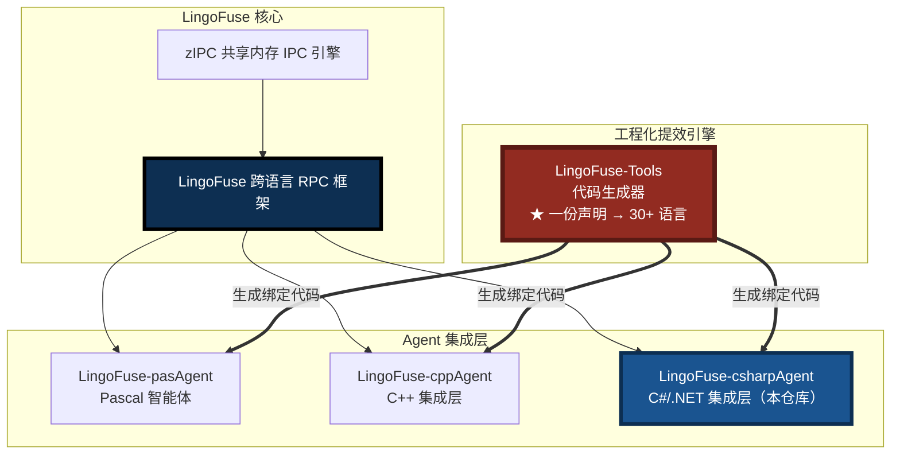

# LingoFuse-csharpAgent

> **C# / .NET 接入 LingoFuse 智能体网络的集成层 —— 声明一次，自动获得 AI Agent 工具、CLI 命令与跨语言插件。**

`LingoFuse-csharpAgent` 是 [LingoFuse](https://github.com/PassByYou888/LingoFuse) 跨语言智能体通讯体系的 **C#/.NET 官方集成层**，基于 LingoFuse 底层 C ABI 构建，提供完整的 .NET 绑定、Agent 运行时、LLM 客户端 SDK 与工具提供者示例。

---

## ⭐ 核心亮点

| 特性 | 说明 |
|------|------|
| **工程化提效引擎** | 基于 [LingoFuse-Tools](https://github.com/PassByYou888/LingoFuse-Tools) —— **一份声明，自动生成 30+ 语言的绑定代码**，是体系工程化的重中之重 |
| **原生 .NET 绑定** | 完整的 `LingoFuse_cs` 库，覆盖 DataHandle、AppHandle、Framework、NetworkEvents、LfIo 等全部底层能力 |
| **Agent 运行时** | `agent_service`（信标服务）+ `agent_api`（工具提供者），开箱即用 |
| **LLM 客户端 SDK** | `llm_csharp_tool` 提供事件驱动的多会话流式客户端，支持能力发现、附件、Structured Output |
| **AI Agent 工具** | 任何 C# 函数注册为 LingoFuse Call API 后，AI Agent 即可自动发现并调用 |
| **跨语言互通** | 用 C# 编写的工具，可被 Pascal、Python、C++、Rust 等任何 LingoFuse 客户端调用 |
| **统一 JSON 策略** | 全链路 UTF-8 无转义、NUL 终止、代理对重写，与其他语言绑定字节级兼容 |

---

## 🛠️ LingoFuse-Tools —— 工程化提效的核心引擎

> **这是整个体系工程化的重中之重。** 没有它，30+ 语言的绑定维护将陷入人力泥潭；有了它，**声明一次，所有语言的 API 接口自动落地**。

[LingoFuse-Tools](https://github.com/PassByYou888/LingoFuse-Tools) 是 LingoFuse 生态的 **代码生成工具链**，它解决的是跨语言开发中最昂贵的工程问题：**同一份 API 契约，如何在几十种编程语言中保持一致**。

### 它解决什么问题

传统跨语言集成的痛点：

- 手写每份绑定 → 30 种语言 × N 个 API = **人力不可承受**
- 契约漂移 → 各语言版本之间参数名、类型、默认值不一致
- 维护地狱 → 上游改一个字段，下游要改 30 处

**LingoFuse-Tools 的答案**：把 API 契约抽出来，写成**一份声明**，工具自动生成所有语言的接口层。



### 提供的交付物

| 交付物 | 说明 |
|--------|------|
| **声明规范** | 如何用统一格式描述一个 API 契约（名称、参数、类型、默认值、文档） |
| **使用手册** | 从声明到生成的完整工作流指南 |
| **生成器源码** | 工具本身的实现源码，可扩展、可定制 |
| **预编译包** | 开箱即用的二进制版本，无需自行编译 |

### 对 C# / .NET 开发者的价值

| 场景 | 手工方式 | 使用 LingoFuse-Tools |
|------|----------|---------------------|
| **新增一个工具 API** | 手写 C# 侧 + 其他语言侧共 30 份代码 | 改一处声明，重新生成 |
| **修改 API 参数** | 30 处逐一修改，极易漏改 | 改一处声明，重新生成 |
| **API 契约一致性** | 靠代码评审与人工纪律 | 由工具保证，不可能漂移 |
| **接入新语言** | 从零手写绑定 | 生成器扩展一种语言模板即可 |

### 工程化价值总结

> **一句话**：`LingoFuse-Tools` 把"跨语言"从**人力工程**变成**声明工程**——这是 LingoFuse 体系能在 30+ 语言之间保持契约一致的**根本保障**。

**仓库地址**：[https://github.com/PassByYou888/LingoFuse-Tools](https://github.com/PassByYou888/LingoFuse-Tools)

---

## 多语言支持（C# / .NET 视角）

LingoFuse 的核心设计目标是 **让所有编程语言平等对话**。`LingoFuse-csharpAgent` 是这一目标在 .NET 生态的落地实现：

| 语言 | 状态 | 说明 |
|------|:----:|------|
| **Pascal** | 生产就绪 | 原生 FFI，完整绑定 |
| **Python** | 生产就绪 | `pip install -e .` 即用 |
| **C++** | 生产就绪 | 原生 C ABI，零开销 |
| **C# / .NET** | ✅ **生产就绪** | **完整 .NET 绑定，服务端 / 调用端全支持**（本仓库） |
| **Node.js / PHP / 浏览器** | HTTP 桥接 | `bridge.py` 网关 |
| **Rust / Go / Java 等** | ⏳ 接入中 | 欢迎贡献绑定 |

> **目标**：让地球上 30+ 种编程语言能够无缝互调。
>
> **如何实现**：靠 [LingoFuse-Tools](https://github.com/PassByYou888/LingoFuse-Tools) 代码生成器——**一份声明 → 所有语言的接口层**。

---

## 🚀 快速开始

### 环境要求

- .NET SDK 8.0+
- LingoFuse 原生动态库（`LingoFuse64.dll` / `liblingofuse.so`）位于系统 PATH 或可执行文件同目录
- 可选：LM Studio / Ollama / 任意 OpenAI 兼容后端（用于 LLM 客户端场景）

### 构建

```powershell
cd src\csharp_solved
.\build.ps1
```

### 启动信标服务（工具注册中心）

```powershell
.\agent_service.exe
```

### 启动工具提供者（示例：计算器）

```powershell
.\agent_api.exe
```

### 启动 LLM 客户端

```powershell
.\llm_csharp_tool.exe --endpoint ipc:llm_service --server-app LLM_Service
```

交互模式中输入问题即可测试完整的 AI 工具调用闭环。

---

## 仓库结构

```
LingoFuse-csharpAgent/
├── src/
│   ├── csharp_solved/                    # C# 解决方案根目录
│   │   ├── LingoFuse_cs/                 # LingoFuse .NET 绑定库
│   │   │   ├── DataHandle.cs             # 数据缓冲区 RAII 封装
│   │   │   ├── AppHandle.cs              # 应用句柄与 API 注册
│   │   │   ├── Framework.cs              # 进程级原生函数门面
│   │   │   ├── LfIo.cs                   # 统一 JSON / 字符串 I/O
│   │   │   ├── NetworkEvents.cs          # 网络事件回调
│   │   │   ├── LingoFuseStatus.cs        # 状态队列与健康检查
│   │   │   ├── LingoFuseException.cs     # 异常体系
│   │   │   └── Native/                   # P/Invoke 层
│   │   │       ├── NativeMethods.cs      # C ABI 声明
│   │   │       ├── NativeTypes.cs        # 句柄与回调原型
│   │   │       └── Utf8Marshal.cs        # UTF-8 编组辅助
│   │   ├── agent_service/                # 信标服务（工具注册中心）
│   │   ├── agent_api/                    # 工具提供者（示例：计算器）
│   │   └── llm_csharp_tool/              # LLM 客户端 SDK 与 CLI
│   ├── lingofuse/                        # LingoFuse Python 绑定（跨语言参考）
│   ├── llm_common/                       # LLM 共享模块（Python 侧）
│   ├── build_all.ps1                     # 全量构建脚本
│   ├── build_llm_service.ps1             # LLM 服务构建脚本
│   └── ...                               # 其他 Python 服务与文档
└── LICENSE
```

---

## 核心组件

### 1. `LingoFuse_cs` —— .NET 绑定库

完整的 LingoFuse .NET 绑定，提供以下能力：

| 模块 | 职责 |
|------|------|
| `DataHandle` | 原生数据缓冲区的 RAII 封装，支持字节 I/O、原子类型读写、NUL 帧字符串 |
| `AppHandle` | 应用句柄管理，Call / Notify API 注册与本地调用 |
| `Framework` | 进程级原生函数门面：网络准备、远程调用、运行时选项、关闭 |
| `LfIo` | **统一 JSON 与字符串 I/O**，全链路 UTF-8 无转义策略 |
| `NetworkEvents` | 进程级网络连接 / 断开事件回调 |
| `LingoFuseStatus` | 状态队列读取与健康检查 |
| `Native/` | P/Invoke 声明层，是唯一调用原生代码的地方 |

**统一 JSON 策略**：`LfIo` 保证所有 JSON 输出采用 `UnsafeRelaxedJsonEscaping` + 代理对重写，使 C# 生成的 JSON 与 Pascal、Python、C++ 绑定**字节级兼容**。

### 2. `agent_service` —— 信标服务

工具注册中心，暴露以下 Call API：

| API | 职责 |
|-----|------|
| `agent_log` | 接收日志消息并输出到控制台 |
| `agent_main` | 返回当前可用工具列表（JSON） |
| `register_agent` | 动态注册 / 替换工具定义 |

### 3. `agent_api` —— 工具提供者（示例）

计算器工具提供者，注册四个 Call API：

| API | 职责 |
|-----|------|
| `add` | 整数加法 |
| `sub` | 整数减法 |
| `mul` | 整数乘法 |
| `div` | 整数除法（浮点结果） |

启动后自动向信标注册工具定义，AI Agent 即可发现并调用。

### 4. `llm_csharp_tool` —— LLM 客户端 SDK

事件驱动的多会话流式客户端，支持：

- **三种调度模式**：主线程泵、专用调度线程、直通回调线程
- **能力发现**：运行时查询服务端 API 能力矩阵
- **附件支持**：文本文件与图片文件附件
- **Structured Output**：JSON Schema 约束生成
- **会话管理**：创建、切换、关闭、取消
- **工具调用**：与 LTB / MCP 网关配合，实现 AI 自动调用后端工具

---

## 与 LingoFuse 生态的关系

`LingoFuse-csharpAgent` 是 LingoFuse 多语言智能体体系在 .NET 生态的落地实现：



**三层结构**：

- **底层（Core）**：`LingoFuse` 提供跨语言 RPC 通信；`zIPC` 提供共享内存 IPC 引擎
- **工程化引擎（Engine）**：`LingoFuse-Tools` 将一份 API 声明自动生成到 30+ 种目标语言——**这是体系工程化的核心引擎**
- **同级集成层（Agents）**：Pascal（pasAgent）、C++（cppAgent）、C#/.NET（本仓库）——三者均受益于 `LingoFuse-Tools` 的代码生成

---

## 典型应用场景

### 场景 1：C# 工具被 AI 自动调用

将已有的 C# 业务函数注册为 LingoFuse Call API，AI Agent 即可通过自然语言调用。无需编写 MCP 服务器、无需搭 HTTP 服务。

### 场景 2：跨语言工具复用

一个用 C# 编写的定价引擎 / 仿真核心 / 批处理模块，可被 Python 数据科学家、Node.js 前端、Pascal 桌面应用同时调用——**声明一次，所有语言可用**。

**这里的"声明一次"由 [LingoFuse-Tools](https://github.com/PassByYou888/LingoFuse-Tools) 落地**：写一份声明，生成器为每种语言产出类型安全、参数一致的绑定代码。

### 场景 3：本地 / 私有 AI Agent

`llm_csharp_tool` + `llm_service` 组合可在完全离线的环境中运行 AI Agent。敏感数据不出内网，所有推理在本地完成。

### 场景 4：多语言团队的 API 契约治理

一个由 C#、Pascal、Python、Node.js 组成的多语言团队，通过 `LingoFuse-Tools` 统一管理 API 契约。**契约变更不再需要跨团队协调，改一处声明即可**。

---

## 文档索引

| 文档 | 说明 |
|------|------|
| `src/LingoFuse_LLM_Ecosystem_User_Guide.md` | LingoFuse LLM 生态总览 |
| `src/LingoFuse_LLM_Proxy_CLI_Guide.md` | 纯转发代理命令行手册 |
| `src/LingoFuse_LLM_Proxy_Tool_CLI_Guide.md` | LLM 工具桥（LTB）命令行手册 |
| `src/LingoFuse_LLM_Service_CLI_guide.md` | 本地推理服务命令行手册 |
| `src/LingoFuse_LLM_Proxy_Compatibility_Guide.md` | 250+ OpenAI 兼容后端清单 |
| `src/NVIDIA-Nemotron-3-Nano-Omni-30B-A3B-Reasoning-UD-IQ4_XS.md` | 推荐模型下载与部署指南 |
| `src/lingofuse/Bridge_User_Guide.md` | HTTP 桥接网关使用指南 |

### 相关项目的核心文档

| 文档 | 位置 | 说明 |
|------|------|------|
| **LingoFuse-Tools 声明规范** | [LingoFuse-Tools](https://github.com/PassByYou888/LingoFuse-Tools) | API 声明格式与语义 |
| **LingoFuse-Tools 使用手册** | [LingoFuse-Tools](https://github.com/PassByYou888/LingoFuse-Tools) | 从声明到生成的完整工作流 |
| **LingoFuse-Tools 生成器源码** | [LingoFuse-Tools](https://github.com/PassByYou888/LingoFuse-Tools) | 工具实现与语言模板 |
| **LingoFuse-Tools 预编译包** | [LingoFuse-Tools](https://github.com/PassByYou888/LingoFuse-Tools) | 开箱即用的二进制版本 |

---

## 许可证

本项目采用 MIT 许可证。详见 [LICENSE](LICENSE) 文件。

---

## 相关项目

| 项目 | 说明 |
|------|------|
| [LingoFuse](https://github.com/PassByYou888/LingoFuse) | 智能体时代的跨语言通讯底座 |
| [zIPC](https://github.com/PassByYou888/zIPC) | 共享内存 + 消息队列 IPC 引擎 |
| [**LingoFuse-Tools**](https://github.com/PassByYou888/LingoFuse-Tools) | **★ 代码生成工具链 —— 一份声明 → 30+ 语言绑定（工程化核心）** |
| [LingoFuse-pasAgent](https://github.com/PassByYou888/LingoFuse-pasAgent) | Pascal 智能体技术体系（v2，纯文本） |
| [LingoFuse-pasAgent-v3](https://github.com/PassByYou888/LingoFuse-pasAgent-v3) | Pascal 智能体技术体系（v3，多模态） |
| [LingoFuse-cppAgent](https://github.com/PassByYou888/LingoFuse-cppAgent) | C++ 集成层 |

---

**维护者**：PassByYou888

**反馈**：问题提 Issue
