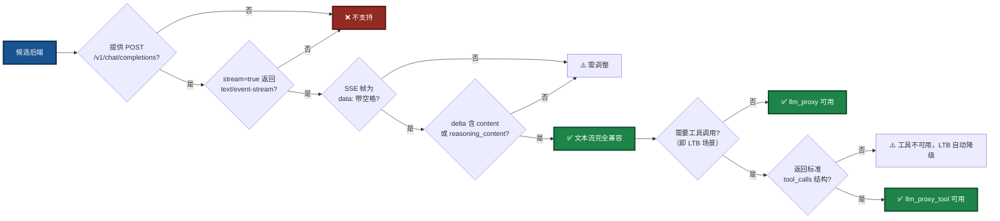
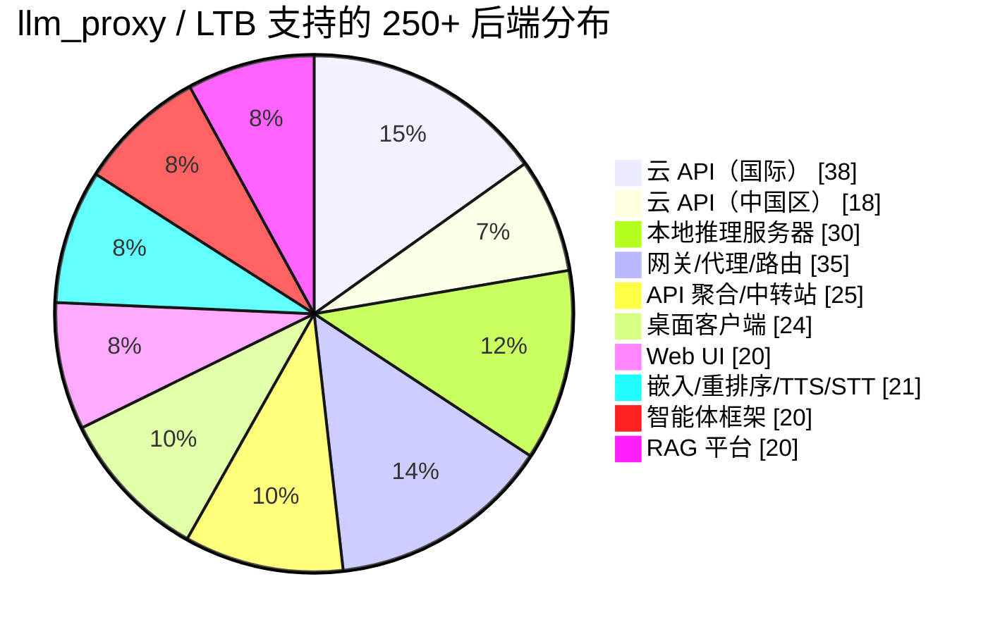

# LingoFuse LLM Proxy 兼容性指南

> **适用组件**：`llm_proxy`、`llm_proxy_tool`（LTB）
> **文档版本**：v5.0（v3 架构重写版 · 去链接多语言中立版 · 250+ 条目）
> **最后更新**：2026-09-28
> **文档定位**：中立的多语言工具系统参考。本指南描述 LLM 代理与工具桥的后端兼容性判据，面向所有支持 LingoFuse 协议的编程语言与运行时环境。

---

## 一、核心支持逻辑

`llm_proxy` 的兼容性判据**极其单一**——它只认一个端点模式：`POST /v1/chat/completions` 配合 `stream=true` 返回 `text/event-stream`。任何符合此协议的服务，无论它是云 API、本地服务器、网关还是桌面应用，均可通过 `--backend-url` 无缝接入。

`llm_proxy_tool`（**LTB**）在此判据之上**额外要求**：当请求中携带 `tools` 字段时，后端需能返回**标准 OpenAI 格式的 `tool_calls`**。二者的**基础接入规则完全一致**，因此本文档所有关于**后端兼容性**的说明，**对 LTB 同样适用**。

### 图 1：兼容性判定流程



**为什么只有这一条基础判据？** 因为 `llm_proxy` 的实现只做三件事：解析 URL 路径提取 `app` 和 `api`、将请求体原样转发给后端、将后端的 SSE 流逐行解析并映射为 LingoFuse 的 Notify 事件。它不解析业务数据、不校验 `Content-Type`、不关心后端的具体实现。因此，**只要后端在协议层面是 OpenAI 兼容的，`llm_proxy` 就能透传它**。

**关键匹配点**：

| 匹配点 | llm_proxy / LTB 的对应实现 | 说明 |
|--------|---------------------------|------|
| `POST /v1/chat/completions` | `OpenAIStreamClient.stream_chat()` | 硬编码路径，不支持自定义 |
| `Authorization: Bearer <key>` | `_build_headers()` | 支持自定义 header 名与 scheme |
| `stream=true` → `text/event-stream` | `Accept-Encoding: identity` + `http.client` | 强制不压缩，禁用 Nagle |
| `data: {...}\n\n` SSE 帧 | `for raw_line in resp:` | 只认 `data: `（带空格）前缀 |
| `choices[0].delta.content` | `_extract_delta()` | 映射为 `chunk` 事件 |
| `choices[0].delta.reasoning_content` | `_extract_delta()` | 映射为 `think` 事件 |
| `data: [DONE]` | `stream_chat()` 的 `return` | 流结束标记 |
| `choices[0].delta.tool_calls`（LTB 专属） | `stream_chat()` 的累加器 | 按 `index` 拼接 `arguments` 字符串 |
| `image_url` 内容部分（多模态） | `stream_chat()` 原样转发 | **需显式传 `--vision`**；详见第 11 节 |

---

## 二、云 API 提供商（国际）—— 38+ 家

### 2.1 主流云 API

| 平台 | Base URL | 路径 | 多模态 |
|------|----------|------|:------:|
| OpenAI 官方 | `https://api.openai.com` | `/v1/chat/completions` | ✅ |
| Azure OpenAI | `<resource>.openai.azure.com` | `/openai/deployments/<name>/chat/completions` | ✅ |
| Anthropic Claude | `https://api.anthropic.com` | 通过兼容层 | ✅ |
| Google Vertex AI | `https://<region>-aiplatform.googleapis.com` | 通过兼容层 | ✅ |
| Mistral AI | `https://api.mistral.ai` | `/v1/chat/completions` | ❌ |
| Groq | `https://api.groq.com` | `/openai/v1/chat/completions` | ❌ |
| Together AI | `https://api.together.xyz` | `/v1/chat/completions` | ✅ |
| DeepInfra | `https://api.deepinfra.com` | `/v1/openai/chat/completions` | ✅ |
| Cerebras | `https://api.cerebras.ai` | `/v1/chat/completions` | ❌ |
| Fireworks AI | `https://api.fireworks.ai` | `/inference/v1/chat/completions` | ✅ |
| Baseten | `https://inference.baseten.co` | `/v1/chat/completions` | ❌ |
| Cohere | `https://api.cohere.ai` | `/compatibility/v1/chat/completions` | ❌ |
| xAI (Grok) | `https://api.x.ai` | `/v1/chat/completions` | ✅ |
| Nebius Token Factory | 有 OpenAI 兼容端点 | `/v1/chat/completions` | ❌ |
| DigitalOcean Serverless Inference | 有 OpenAI 兼容端点 | `/v1/chat/completions` | ❌ |
| Perplexity | `https://api.perplexity.ai` | `/chat/completions` | ❌ |
| Hugging Face Inference | `https://router.huggingface.co` | `/v1/chat/completions` | ✅ |
| OpenRouter | `https://openrouter.ai` | `/api/v1/chat/completions` | ✅ |
| Cloudflare Workers AI | `https://api.cloudflare.com/client/v4/accounts/<id>/ai/v1` | `/chat/completions` | ✅ |
| GitHub Models | `https://models.inference.ai.azure.com` | `/chat/completions` | ✅ |
| SambaNova | 有 OpenAI 兼容端点 | `/v1/chat/completions` | ❌ |
| Hyperbolic | 有 OpenAI 兼容端点 | `/v1/chat/completions` | ❌ |
| Novita AI | 有 OpenAI 兼容端点 | `/v1/chat/completions` | ✅ |
| Anyscale Endpoints | 有 OpenAI 兼容端点 | `/v1/chat/completions` | ❌ |
| Replicate | 有 OpenAI 兼容端点 | `/v1/chat/completions` | ✅ |
| AI21 Labs | 有 OpenAI 兼容端点 | `/v1/chat/completions` | ❌ |
| Writer | 有 OpenAI 兼容端点 | `/v1/chat/completions` | ❌ |
| GMI Cloud | `https://api.gmi-serving.com/v1` | `/chat/completions` | ❌ |
| LLM7.io | `https://api.llm7.io/v1` | `/chat/completions` | ❌ |
| DeepSeek | `https://api.deepseek.com` | `/v1/chat/completions` | ❌ |
| Moonshot (Kimi) | `https://api.moonshot.cn/v1` | `/chat/completions` | ❌ |
| Voyage AI | 嵌入为主 | `/v1/embeddings` | — |
| Jina AI | 嵌入为主 | `/v1/embeddings` | — |
| Mixedbread AI | 嵌入 / 重排序 | `/v1/embeddings` | — |
| Nomic AI | 嵌入为主 | `/v1/embeddings` | — |
| Cohere（嵌入） | `https://api.cohere.ai` | `/v1/embed` | — |
| Voyage AI（重排序） | 重排序为主 | `/v1/rerank` | — |
| Jina AI（重排序） | 重排序为主 | `/v1/rerank` | — |

### 2.2 云 API 提供商（中国区）—— 18+ 家

| 平台 | Base URL | 路径 |
|------|----------|------|
| DeepSeek | `https://api.deepseek.com` | `/v1/chat/completions` |
| 硅基流动 (SiliconFlow) | `https://api.siliconflow.cn` | `/v1/chat/completions` |
| 阿里云 DashScope (百炼) | `https://dashscope.aliyuncs.com/compatible-mode` | `/v1/chat/completions` |
| 火山引擎 (豆包) | `https://ark.cn-beijing.volces.com/api/v3` | `/chat/completions` |
| 智谱 (GLM) | `https://open.bigmodel.cn/api/paas/v4` | `/chat/completions` |
| MiniMax | `https://api.minimax.chat/v1` | `/chat/completions` |
| 月之暗面 (Moonshot) | `https://api.moonshot.cn/v1` | `/chat/completions` |
| 零一万物 (Yi) | `https://api.lingyiwanwu.com/v1` | `/chat/completions` |
| 百川智能 | `https://api.baichuan-ai.com/v1` | `/chat/completions` |
| 腾讯混元 | `https://api.hunyuan.cloud.tencent.com/v1` | `/chat/completions` |
| 百度文心 | `https://qianfan.baidubce.com/v2` | `/chat/completions` |
| 讯飞星火 | `https://spark-api-open.xf-yun.com/v1` | `/chat/completions` |
| 阶跃星辰 | `https://api.stepfun.com/v1` | `/chat/completions` |
| 商汤日日新 | 有 OpenAI 兼容端点 | `/v1/chat/completions` |
| 昆仑万维天工 | 有 OpenAI 兼容端点 | `/v1/chat/completions` |
| 优刻得星图 AstraFlow | 有 OpenAI 兼容端点 | `/v1/chat/completions` |
| TokenRhythm | 对标 OpenRouter | `/v1/chat/completions` |
| 腾讯云第三方大模型 | `https://api.cloud.tencent.com` | `/v1/chat/completions` |

---

## 三、本地推理服务器 —— 30+ 个

| 服务器 | 默认端点 | 多模态 |
|--------|----------|:------:|
| **LM Studio** | `http://localhost:1234/v1/chat/completions` | ✅ |
| **llama.cpp (llama-server)** | `http://localhost:8080/v1/chat/completions` | ✅ |
| **vLLM** | `http://localhost:8000/v1/chat/completions` | ✅ |
| **Ollama** | `http://localhost:11434/v1/chat/completions` | ✅ |
| **LocalAI** | `http://localhost:8080/v1/chat/completions` | ✅ |
| **TGI (Text Generation Inference)** | `http://localhost:8080/v1/chat/completions` | ✅ |
| **SGLang** | `http://localhost:30000/v1/chat/completions` | ✅ |
| **TabbyAPI** | 有 OpenAI 兼容端点 | ❌ |
| **KoboldCPP** | 有 OpenAI 兼容端点 | ❌ |
| **text-generation-webui** | 有 OpenAI 兼容扩展 | ❌ |
| **MLX Omni Server** | Apple Silicon 专用 | ❌ |
| **Kronk** | 基于 llama.cpp | ✅ |
| **Shimmy** | 纯 Rust WebGPU | ❌ |
| **Lemonade Server** | `http://localhost:13305/api/v1` | ✅ |
| **OpenLLM (BentoML)** | 一键部署 | ❌ |
| **MLC LLM** | 有 OpenAI 兼容端点 | ✅ |
| **LitGPT** | 有 OpenAI 兼容端点 | ❌ |
| **xinfer** | 纯 Rust 推理 | ❌ |
| **paddock** | NVIDIA GPU 原生 Rust | ❌ |
| **Kolosal Server** | 有 OpenAI 兼容端点 | ❌ |
| **HybridInfer** | 本地 OpenAI 兼容 | ❌ |
| **Rapid-MLX** | Apple Silicon 专用 | ❌ |
| **Dify 本地部署** | 有 OpenAI 兼容端点 | ✅ |
| **LLM-Proxy (Nayjest)** | 有 OpenAI 兼容端点 | ❌ |
| **Fake OpenAI Server** | 嵌入 / 重排序 | — |
| **Furiosa-LLM** | 有 OpenAI 兼容端点 | ❌ |
| **Xinference** | 有 OpenAI 兼容端点 | ✅ |
| **MLX-VLM** | Apple Silicon 多模态 | ✅ |
| **Candle** | Rust 推理框架 | ❌ |
| **llamafile** | 单文件推理 | ✅ |

---

## 四、网关 / 代理 / 路由 —— 35+ 个

| 网关 | 语言 |
|------|------|
| **LiteLLM** | Python |
| **Portkey Gateway** | TypeScript |
| **Helicone AI Gateway** | Rust |
| **OmniRoute** | TypeScript |
| **New API** | Go |
| **One API** | Go |
| **GoModel** | Go |
| **Bifrost** | Go |
| **Vercel AI Gateway** | 云服务 |
| **Cloudflare AI Gateway** | 云服务 |
| **Braintrust** | 云服务 |
| **AISIX** | 云服务 |
| **Higress** | Go |
| **LLM0 Gateway** | — |
| **freellmapi-proxy** | — |
| **ProxyGateLLM** | — |
| **neurogate** | — |
| **Brick** | — |
| **venagate** | TypeScript |
| **CLIProxyAPI** | — |
| **gptoss-proxy** | JavaScript |
| **Kong AI Gateway** | Lua |
| **APIClaw** | — |
| **A3M Router** | Node.js |
| **LateDev Router** | Node.js |
| **OrcaRouter** | 云服务 |
| **FreeRouter Gateway** | Node.js |
| **EURouter** | — |
| **JAiRouter** | Java |
| **freeport** | Node.js |
| **ai-api-gateway** | Node.js |
| **Tetrate Agent Router** | 云服务 |
| **TokenMix** | 聚合服务 |
| **Apiário** | 聚合服务 |
| **RouteLLM** | Python |

---

## 五、API 聚合 / 中转站 —— 25+ 家

| 平台 | 说明 |
|------|------|
| **OpenRouter** | 500+ 模型聚合 |
| **Ollama Cloud** | 400+ 模型，云端 GPU |
| **Kluster AI** | 有免费额度 |
| **Free-The-Ai** | 50+ 模型，免费 |
| **FreeLLMAPI** | 14 家平台免费额度聚合 |
| **proaiapi.tech** | 企业级首选 |
| **n1n.ai** | 企业级专线 |
| **PoloAPI** | 老牌，折扣力度大 |
| **星链 4SAPI** | 边缘节点优化 |
| **云雾 API (YUNWU)** | 国内中转 |
| **玄枢 API (XuanShu API)** | 国内中转 |
| **TeamoRouter** | OpenAI / Anthropic / Gemini 兼容 |
| **CometAPI** | 多模型路由 |
| **OfoxAI** | 100+ LLM 统一网关 |
| **Eden AI** | 多模态聚合 |
| **RouterBase** | 200+ 前沿模型 |
| **Apiário** | 巴西开发者聚合 |
| **TokenMix** | 171 模型，14 提供商 |
| **TokenRhythm** | 中国版 OpenRouter |
| **AI/ML API** | 300+ 模型聚合 |
| **Nano-GPT** | 多模型聚合 |
| **Requesty** | LLM 路由聚合 |
| **Unify AI** | 智能路由聚合 |
| **Martian** | 模型路由聚合 |
| **Not Diamond** | 智能模型路由 |

---

## 六、桌面客户端（自带 OpenAI 兼容 Server）—— 24+ 个

| 工具 | 平台 | 多模态 |
|------|------|:------:|
| **LM Studio** | Windows / macOS / Linux | ✅ |
| **GPT4All** | Windows / Linux / macOS | ❌ |
| **Jan** | Windows / macOS / Linux | ❌ |
| **Ollama** | Windows / macOS / Linux | ✅ |
| **Lobe Chat** | Windows / macOS / Linux | ✅ |
| **PyGPT** | Windows / Linux / macOS | ✅ |
| **OOLIS** | 桌面 | ❌ |
| **Msty** | macOS / Windows / Linux | ❌ |
| **Elvean** | macOS | ❌ |
| **LLM FX** | 桌面客户端 | ❌ |
| **TurboLLM** | 桌面 | ❌ |
| **RWKV Runner** | 桌面 | ❌ |
| **ChatQT** | Linux (Flatpak) | ❌ |
| **Sigma Oasis** | macOS / Windows / Linux | ❌ |
| **local-chat** | 跨平台 | ✅ |
| **Delta** | 离线优先 | ❌ |
| **AI Server Studio** | 桌面 | ✅ |
| **Atomic Chat** | 跨平台 | ✅ |
| **openchat-llm** | Windows 预览 | ❌ |
| **AQBot** | 跨平台 | ✅ |
| **Fello** | macOS / Windows / Linux | ❌ |
| **Chatbox** | Windows / macOS / Linux | ✅ |
| **Cherry Studio** | Windows / macOS / Linux | ✅ |
| **NextChat** | Windows / macOS / Linux（同时是 Web UI，见第 7 节） | ✅ |

> **说明**：`NextChat`（原名 `ChatGPT-Next-Web`）同时是"桌面客户端"和"Web UI"，因此在第 6 节与第 7 节均出现。

---

## 七、Web UI（OpenAI 兼容前端）—— 20+ 个

| Web UI | 说明 |
|--------|------|
| **Open WebUI** | 最佳 HomeLab 界面 |
| **NextChat** | 轻量响应式（同时提供桌面版，见第 6 节） |
| **Lobe Chat** | 现代 AI 聊天界面 |
| **ChuanhuChatGPT** | 轻快好用 |
| **ChatGPT-web** | 单页简洁界面 |
| **Chatbot UI** | 开源聊天界面 |
| **LibreChat** | 多提供商聊天 |
| **Hollama** | 轻量 Ollama 前端 |
| **Lite WebUI** | 浏览器本地运行 |
| **llampart** | llama-server 专用 |
| **AuraPro UI** | 可扩展离线平台 |
| **Chat UI** | TypeScript/SvelteKit |
| **BetterChatGPT** | 增强版 ChatGPT |
| **TypingMind** | 商业级聊天 UI |
| **ChatALL** | 同时问多个 AI |
| **Big-AGI** | 智能体 Web UI |
| **Dify** | LLMOps 平台 |
| **FastGPT** | 知识库问答平台 |
| **AnythingLLM** | 全栈 RAG 应用 |
| **Open WebUI Lite** | 轻量版 |

---

## 八、嵌入 / 重排序 / TTS / STT（部分支持）—— 21+ 个

以下服务暴露 OpenAI 兼容端点，但 `llm_proxy`（以及 LTB）**只转发 `/v1/chat/completions`**。如需要这些能力，客户端需直连。

### 8.1 嵌入 / 重排序

| 服务器 | 端点 |
|--------|------|
| **Hugging Face TEI** | `/v1/embeddings` |
| **docker-embeddings** | `/v1/embeddings` + `/rerank` |
| **Superlinked Inference Engine** | `/v1/embeddings` |
| **Qwen3 Retrieval Server** | `/v1/embeddings` + `/v1/rerank` |
| **Xinference** | `/v1/embeddings` + `/v1/rerank` |
| **Furiosa-LLM** | `/v1/embeddings` + `/v1/rerank` |
| **vLLM（嵌入/重排序）** | `/v1/embeddings` + `/v1/rerank` |
| **api-embedding** | `/v1/embeddings` |
| **jina-embeddings-v4 server** | `/v1/embeddings` |

### 8.2 TTS / STT

| 服务器 | 端点 |
|--------|------|
| **Speaches** | `/v1/audio/transcriptions` + `/v1/audio/speech` |
| **VoiceStudio** | `/v1/audio/*` |
| **kokoro-fastapi** | `/v1/audio/speech` |
| **tts-server** | `/v1/audio/speech` |
| **omnivoice-server** | `/v1/audio/speech` |
| **supertonic-server** | `/v1/audio/speech` |
| **ChatTTS-OpenAI-API** | `/v1/audio/speech` |
| **bootlegger-voice** | `/v1/audio/*` |
| **OpenMusicx** | Realtime WebSocket |
| **faster-whisper** | `/v1/audio/transcriptions` |
| **Whisper.cpp** | `/v1/audio/transcriptions` |
| **museq** | 23 种模态 |

---

## 九、智能体框架（OpenAI 兼容）—— 20+ 个

| 框架 | 语言 |
|------|------|
| **LightAgent** | Python |
| **loong-agent** | Python |
| **paean-ai/agents** | TypeScript |
| **openai-agents-rust** | Rust |
| **OGX** | Python |
| **Nekora AI** | TypeScript |
| **agentknit** | Python |
| **nagents** | Python |
| **LangChain** | Python / JS |
| **LlamaIndex** | Python / TS |
| **CrewAI** | Python |
| **AutoGen** | Python |
| **Semantic Kernel** | C# / Python |
| **Haystack** | Python |
| **DSPy** | Python |
| **PromptFlow** | Python |
| **Flowise** | TypeScript |
| **n8n** | TypeScript |
| **OpenSquilla** | 多平台 |
| **MCP Gateway** | Docker |

---

## 十、RAG 平台（OpenAI 兼容）—— 20+ 个

| 平台 | 说明 |
|------|------|
| **rwiki** | SQLite RAG |
| **rag.computer** | 自托管 RAG |
| **Ragworks** | 低代码 RAG 工作台 |
| **OpenRAG** | 多租户 RAG |
| **RAGLight** | 模块化 Python RAG |
| **Pi Coding Agent** | Qdrant/pgvector RAG |
| **Dify** | LLMOps + RAG |
| **FastGPT** | 知识库问答 |
| **AnythingLLM** | 全栈 RAG |
| **RAGFlow** | 深度文档理解 RAG |
| **Quivr** | 个人知识库 |
| **Verba** | Weaviate RAG |
| **PrivateGPT** | 本地文档问答 |
| **LocalGPT** | 本地 GPT 文档问答 |
| **Khoj** | 个人 AI 知识库 |
| **Morphik** | 多模态 RAG |
| **RAGatouille** | 轻量 RAG 库 |
| **Canopy** | Pinecone RAG |
| **Chroma** | 向量数据库 + RAG |
| **Qdrant** | 向量数据库 + RAG |

---

## 十一、接入验证

在将任何后端接入 `llm_proxy`（或 LTB）前，用以下命令验证：

```bash
curl -N -X POST http://127.0.0.1:1234/v1/chat/completions \
  -H "Content-Type: application/json" \
  -d '{"model":"<模型 id>","messages":[{"role":"user","content":"hi"}],"stream":true}'
```

| 检查项 | 通过条件 | 不通过的应对 |
|--------|----------|--------------|
| HTTP 状态 | `200 OK` | 检查 `--backend-url` 与 `--backend-model` |
| Content-Type | `text/event-stream` | 后端未开启流式 |
| 帧前缀 | `data: `（含尾随空格） | 若为 `data:{...}` 需扩展 |
| 输出节奏 | 逐 token 逐行实时 | 若整段输出，检查 gzip |
| delta 字段 | 含 `content` 或 `reasoning_content` | 若否则扩展 `_extract_delta` |
| 结束标记 | `data: [DONE]` | 若缺失，后端未完整实现 SSE |

### 11.1 LTB 额外验证（需要工具调用时）

```bash
curl -N -X POST http://127.0.0.1:1234/v1/chat/completions \
  -H "Content-Type: application/json" \
  -d '{
    "model":"<模型 id>",
    "messages":[{"role":"user","content":"5+7 等于几？"}],
    "stream":true,
    "tools":[{
      "type":"function",
      "function":{
        "name":"add",
        "description":"Add two integers",
        "parameters":{
          "type":"object",
          "properties":{
            "a":{"type":"integer"},
            "b":{"type":"integer"}
          },
          "required":["a","b"]
        }
      }
    }]
  }'
```

**判据**：

- SSE 流中应出现 `delta.tool_calls` 字段。
- 所有分片的 `arguments` 应按 `index` 拼接后形成合法 JSON（如 `{"a":5,"b":7}`）。
- 若后端**始终返回纯文本而不触发 `tool_calls`**，说明模型不支持 Function Calling，或未正确配置 `tool_choice`。

### 11.2 多模态验证（需要图片问答时）

```bash
curl -N -X POST http://127.0.0.1:1234/v1/chat/completions \
  -H "Content-Type: application/json" \
  -d '{
    "model":"<VLM 模型 id>",
    "messages":[{
      "role":"user",
      "content":[
        {"type":"text","text":"描述这张图"},
        {"type":"image_url","image_url":{"url":"data:image/png;base64,iVBORw0KGgoAAAANSUhEUg..."}}
      ]
    }],
    "stream":true
  }'
```

**判据**：

- 后端返回的文字描述中应**提到图片内容**（如颜色、物体、场景）。
- 若后端回复"我没看到图片"或忽略图片，说明：
  - 后端未加载 VLM（加载的是纯文本模型）。
  - 或后端不支持 OpenAI 多模态 `image_url` 格式。
- **LingoFuse 侧的额外步骤**：接入 `llm_proxy` / LTB 时，**必须显式传 `--vision`**——否则图片附件会被服务端**拒绝**（返回 `code: -1`），根本不会到达后端。

详见 `LingoFuse_LLM_Proxy_CLI_Guide.md` 第 5.5 节与 `LingoFuse_LLM_Proxy_Tool_CLI_Guide.md` 第 4.5 节。

---

## 十二、已知限制

| 限制 | 说明 |
|------|------|
| **`llm_proxy` 不支持 Function Calling** | 纯文本透传模式，`_extract_delta` 只识别 `content` / `reasoning_content`。**需要 Function Calling 时请用 `llm_proxy_tool`（LTB）**，它在服务端代管工具调用。 |
| **LTB 要求后端在 `tool_calls` 时返回标准 OpenAI 结构** | 即每个 `tool_call` 包含 `index` / `id` / `type: "function"` / `function.name` / `function.arguments`（字符串）。非标准结构需修改 `OpenAIStreamClient.stream_chat` 适配。 |
| 不支持 `set_system_message` | 代理为无状态转发器，会话中途无法切换 system prompt。LTB 同理。 |
| 只认 `/v1/chat/completions` | 不支持 `/completions`、`/responses`、`/embeddings`、`/audio/*` |
| options 白名单 | 仅转发 5 个字段（`max_tokens` / `temperature` / `top_p` / `top_k` / `repeat_penalty`），`seed` / `stop` / `response_format` 等被静默丢弃。LTB 额外转发 `tools` / `tool_choice`。 |
| Azure OpenAI | 路径含 deployment + api-version，需手工拼接到 `--backend-url` |
| 非标准 SSE 帧 | `data:{...}` 无空格会丢帧，反代需保留原格式 |
| 未校验 Content-Type | 后端返回非 SSE 时静默结束，客户端收到空 `finish` |
| 不支持并发工具执行 | LTB 按顺序执行 `tool_calls`，不并发。单轮多工具场景下，串行等待可能增加延迟。 |
| LTB 工具列表不支持运行时刷新 | 启动时拉取一次，运行期间不感知后端工具变化。需重启 LTB 才能感知。 |
| **多模态需显式 `--vision`** | `llm_proxy` / LTB **原样转发**图片附件到后端；**必须传 `--vision` 才能启用**（否则图片附件被拒绝，返回 `code: -1`）。**是否支持取决于后端**。`llm_service` 不支持多模态。 |
| **LTB 多模态 + 工具循环** | 图片只在**首轮**发送完整内容；后续工具调用轮次使用**历史占位符**（如 `[image: chart.png]`）。这避免了 token 爆炸，但后端在后续轮次看不到原图。 |
| **LTB `--no-tools` + `--vision`** | `--no-tools` 会禁用所有工具行为，退化为纯文本代理。此时多模态转发**仍然有效**（如果传了 `--vision`）。但工具能力消失。 |
| **LTB `--vision` 未传 + 工具调用** | 图片请求被拒绝（`code: -1`），工具调用也不会发生。需同时传 `--vision`（若需要图片）和保持 `--enable-tools`（默认开启）。 |

---

## 十三、支持统计

### 图 2：后端分布



| 类别 | 数量 |
|------|:----:|
| 云 API 提供商（国际） | **38+** |
| 云 API 提供商（中国区） | **18+** |
| 本地推理服务器 | **30+** |
| 网关 / 代理 / 路由 | **35+** |
| API 聚合 / 中转站 | **25+** |
| 桌面客户端（自带 Server） | **24+** |
| Web UI（OpenAI 兼容前端） | **20+** |
| 嵌入 / 重排序 / TTS / STT（部分支持） | **21+** |
| 智能体框架 | **20+** |
| RAG 平台 | **20+** |
| **合计** | **250+** |

> **说明**：该清单对 **`llm_proxy`（纯文本代理）与 `llm_proxy_tool`（LTB，服务端工具执行）均适用**。LTB 的核心差异仅在于它会在请求中注入 `tools` 字段，并要求后端在需要时返回标准 `tool_calls` 结构。基础 SSE 客户端完全一致。多模态转发同样适用——**需显式传 `--vision`**。

---

## 十四、中立工具系统定位说明

本兼容性指南所描述的组件属于一个**中立的多语言工具系统**。其设计目标是：

1. **协议中立**：只依赖 OpenAI 兼容的 HTTP + SSE 协议，不绑定任何具体编程语言、运行时或框架。
2. **客户端中立**：任何支持 LingoFuse 协议的客户端（无论用何种语言编写）都可以接入。
3. **后端中立**：任何符合 `/v1/chat/completions` + SSE 的后端都可以作为推理源。
4. **工具中立**：工具的定义与执行由独立的注册中心（信标）和工具提供者管理，与客户端语言解耦。

因此，本指南中不涉及任何具体语言的实现细节，也不针对任何特定语言生态做优化假设。所有示例均以语言无关的 HTTP / 命令行形式给出。

---

**文档版本**：v5.0（v3 架构重写版 · 去链接多语言中立版 · 250+ 条目）

**维护者**：LingoFuse 团队
